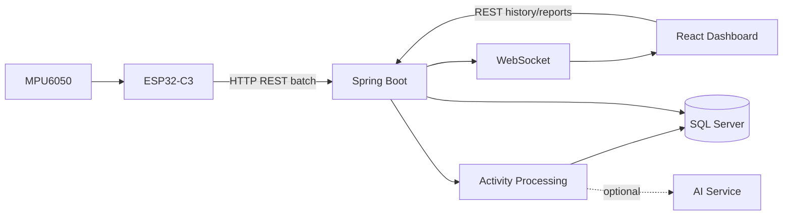
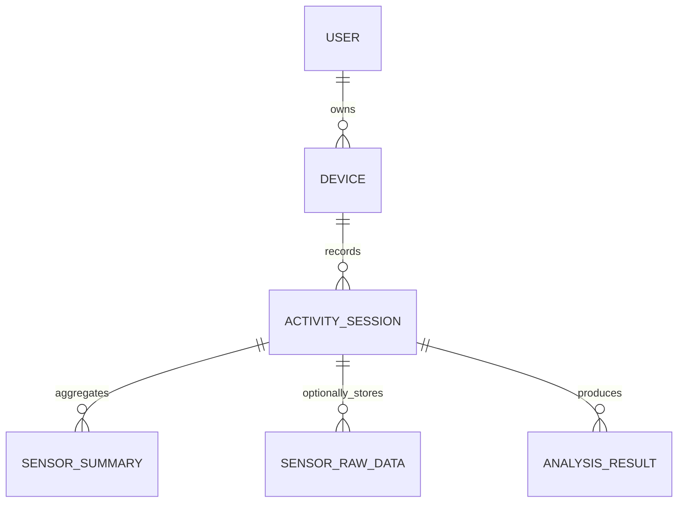

# Second Skin Sport — Backend & Frontend Architecture

Tài liệu kiến trúc đề xuất cho prototype Second Skin Sport: ESP32-C3 + MPU6050, Spring Boot, React và SQL Server. Các package, endpoint và bảng bên dưới là blueprint, chưa khẳng định đã tồn tại trong codebase hiện tại.

## 1. Tổng quan

- **ESP32-C3 + MPU6050:** đọc gia tốc/vận tốc góc, đóng gói và gửi dữ liệu.
- **Spring Boot:** REST API, nghiệp vụ, xác thực thiết bị/người dùng, xử lý dữ liệu.
- **WebSocket:** phát dữ liệu realtime đến client được phép xem.
- **SQL Server:** lưu người dùng, thiết bị, buổi tập, kết quả và dữ liệu thô được chọn lọc.
- **React:** dashboard realtime, biểu đồ, lịch sử và phân tích.
- **AI Service (tùy chọn):** nhận diện hoạt động và phân tích kỹ thuật khi có dữ liệu huấn luyện phù hợp.



**Nguyên tắc:** WebSocket truyền realtime không đồng nghĩa với việc phải lưu mọi mẫu vào database.

## 2. Cấu trúc repository đề xuất

```text
second-skin-sport/
├── backend/
│   └── secondskin-backend/
├── frontend/
│   └── secondskin-frontend/
├── firmware/
│   └── esp32/
├── ai-service/                 # tùy chọn, triển khai sau
├── docs/
│   ├── SYSTEM_ARCHITECTURE.md
│   └── API_SPEC.md
├── .gitignore
└── README.md
```

Có thể giữ nguyên tên thư mục của repository hiện tại; không cần đổi chỉ để khớp ví dụ.

## 3. Backend — Spring Boot

### Cấu trúc thư mục

```text
backend/secondskin-backend/
├── src/main/java/com/secondskin/
│   ├── SecondSkinApplication.java
│   ├── config/
│   │   ├── CorsConfig.java
│   │   ├── WebSocketConfig.java
│   │   └── SecurityConfig.java
│   ├── auth/
│   ├── user/
│   ├── device/
│   ├── sensor/
│   │   ├── SensorController.java
│   │   ├── SensorIngestionService.java
│   │   ├── SensorData.java
│   │   ├── SensorDataRepository.java
│   │   └── dto/
│   ├── session/
│   │   ├── ActivitySession.java
│   │   ├── SessionController.java
│   │   ├── SessionService.java
│   │   └── SessionRepository.java
│   ├── activity/
│   │   ├── ActivityRecognitionService.java
│   │   └── JumpDetectionService.java
│   ├── analysis/
│   ├── realtime/
│   │   └── RealtimePublisher.java
│   └── common/
│       ├── exception/
│       └── response/
├── src/main/resources/
│   ├── application.yml
│   └── db/migration/            # nếu dùng Flyway
├── src/test/
└── pom.xml
```

### Trách nhiệm

| Module | Trách nhiệm |
|---|---|
| `config` | CORS, WebSocket, Security và cấu hình bean |
| `auth` / `user` | Đăng nhập, hồ sơ và quyền truy cập |
| `device` | Đăng ký thiết bị, mã thiết bị, liên kết với tài khoản |
| `sensor` | Nhận batch, validate payload, timestamp và đơn vị đo |
| `session` | Bắt đầu/kết thúc buổi tập |
| `activity` | Phát hiện nhảy/chạy/đi bộ hoặc gọi mô hình AI |
| `analysis` | Lưu và truy vấn kết quả phân tích |
| `realtime` | Phát dữ liệu tới đúng người dùng/thiết bị |
| `common` | Xử lý lỗi và response dùng chung |

Quy tắc thiết kế:
- Controller nhận request và gọi service; tránh đặt toàn bộ business logic trong controller.
- Dùng DTO cho request/response, không trả entity database trực tiếp.
- Xác thực thiết bị; không tin `deviceId` do client gửi nếu chưa kiểm tra quyền.
- Dùng batch insert/transaction khi cần lưu mẫu thô.
- Tạo index theo các truy vấn thực tế, thường cân nhắc `device_id`, `session_id`, `recorded_at`.
- Quản lý schema bằng migration nếu phù hợp.
- Không commit mật khẩu, JWT secret hoặc thông tin kết nối database lên Git.

## 4. Frontend — React + Vite

### Cấu trúc thư mục

```text
frontend/secondskin-frontend/
├── public/
├── src/
│   ├── app/
│   │   ├── App.tsx
│   │   └── router.tsx
│   ├── assets/
│   ├── components/
│   │   ├── common/
│   │   ├── layout/
│   │   ├── charts/
│   │   └── device/
│   ├── features/
│   │   ├── auth/
│   │   ├── dashboard/
│   │   ├── devices/
│   │   ├── sessions/
│   │   ├── activity/
│   │   └── analysis/
│   ├── hooks/
│   │   ├── useSensorWebSocket.ts
│   │   └── useAuth.ts
│   ├── services/
│   │   ├── apiClient.ts
│   │   └── websocketClient.ts
│   ├── types/
│   ├── utils/
│   ├── styles/
│   └── main.tsx
├── .env.example
├── package.json
└── vite.config.ts
```

Nếu project dùng JavaScript, đổi `.tsx` thành `.jsx` và `.ts` thành `.js`.

### Trách nhiệm

- `features/dashboard`: trạng thái thiết bị, biểu đồ realtime và số liệu phiên tập.
- `features/devices`: danh sách và trạng thái thiết bị.
- `features/sessions`: lịch sử và chi tiết buổi tập.
- `features/activity`: loại hoạt động và thống kê.
- `features/analysis`: kết quả phân tích/AI.
- `services/apiClient.ts`: gọi REST API.
- `services/websocketClient.ts`: quản lý kết nối WebSocket.
- `hooks/useSensorWebSocket.ts`: quản lý lifecycle kết nối trong React.
- `components/charts`: biểu đồ gia tốc, gyro và dữ liệu theo thời gian.

Frontend nên đóng/hủy subscription khi rời dashboard, xử lý mất kết nối và giới hạn số điểm hiển thị trên biểu đồ. Không đặt secret trong biến `VITE_*`, vì biến frontend có thể bị lộ trong bundle.

## 5. Luồng dữ liệu

1. MPU6050 đo gia tốc và vận tốc góc.
2. ESP32-C3 lấy mẫu, gắn timestamp và gửi batch bằng HTTP.
3. Spring Boot kiểm tra thiết bị, payload, timestamp và đơn vị đo.
4. Backend phát dữ liệu realtime qua WebSocket đến client có quyền.
5. Bộ xử lý phân tích một cửa sổ mẫu để nhận diện hoạt động.
6. Backend lưu kết quả sự kiện/buổi tập; chỉ lưu dữ liệu thô khi có nhu cầu.
7. React cập nhật biểu đồ và hiển thị lịch sử.

Ví dụ payload:

```json
{
  "deviceId": "SECOND-SKIN-01",
  "sessionId": "session-123",
  "samples": [
    {
      "timestamp": "2026-10-04T12:00:00.010Z",
      "ax": 0.86,
      "ay": -0.29,
      "az": 9.68,
      "gx": -1.40,
      "gy": -1.13,
      "gz": -1.37
    }
  ]
}
```

Thống nhất đơn vị: gia tốc dùng m/s² hoặc g; gyro dùng °/s. Không trộn hai quy ước.

## 6. REST API và WebSocket gợi ý

Các endpoint này là đề xuất, chưa chắc đã được triển khai.

| Method | Endpoint | Mục đích |
|---|---|---|
| `POST` | `/api/v1/sensor/batches` | Nhận batch cảm biến |
| `GET` | `/api/v1/devices` | Danh sách thiết bị của người dùng |
| `GET` | `/api/v1/devices/{deviceId}` | Chi tiết thiết bị |
| `POST` | `/api/v1/sessions` | Bắt đầu buổi tập |
| `PATCH` | `/api/v1/sessions/{sessionId}/finish` | Kết thúc buổi tập |
| `GET` | `/api/v1/sessions` | Lịch sử buổi tập |
| `GET` | `/api/v1/sessions/{sessionId}/analysis` | Kết quả phân tích |

WebSocket có thể dùng destination như `/topic/devices/{deviceId}/realtime`, nhưng backend phải kiểm tra quyền subscribe. Không cho người dùng xem dữ liệu của thiết bị khác chỉ bằng cách thay ID.

## 7. Chiến lược database



| Bảng | Dữ liệu |
|---|---|
| `User` | Tài khoản người dùng |
| `Device` | Thiết bị và chủ sở hữu |
| `ActivitySession` | Thời gian và thông tin buổi tập |
| `SensorSummary` | Chỉ số trung bình/cực đại, số lần nhảy theo khoảng thời gian |
| `SensorRawData` | Mẫu chi tiết, chỉ lưu theo chính sách |
| `AnalysisResult` | Hoạt động nhận diện và kết quả phân tích |

Đề xuất:
- Realtime không bắt buộc ghi database.
- Ưu tiên lưu sự kiện và dữ liệu tổng hợp cho lịch sử thông thường.
- Batch insert dữ liệu thô khi cần nghiên cứu/debug.
- Đặt retention policy, ví dụ giữ dữ liệu thô 7–30 ngày nếu phù hợp yêu cầu; dữ liệu quan trọng cần được sao lưu trước khi xóa.
- Khi tải tăng, thêm buffer/queue bền vững để giảm nguy cơ mất dữ liệu khi database tạm thời lỗi.

## 8. Cấu hình môi trường

Backend dùng environment variables, ví dụ:

```properties
SPRING_DATASOURCE_URL=jdbc:sqlserver://localhost:1433;databaseName=secondskin;encrypt=true;trustServerCertificate=true
SPRING_DATASOURCE_USERNAME=...
SPRING_DATASOURCE_PASSWORD=...
JWT_SECRET=...
```

`trustServerCertificate=true` chỉ nên dùng trong môi trường phát triển được kiểm soát; production cần cấu hình TLS phù hợp.

Frontend `.env.example`:

```dotenv
VITE_API_BASE_URL=http://localhost:8080/api/v1
VITE_WS_BASE_URL=ws://localhost:8080/ws
```

Đổi URL theo môi trường deploy; dùng HTTPS/WSS khi chạy production.

## 9. Lộ trình

### Giai đoạn 1 — MVP
- Nhận batch cảm biến từ ESP32.
- REST endpoint và database cơ bản.
- Dashboard React realtime.
- Lưu kết quả nhảy và tổng kết buổi tập.

### Giai đoạn 2 — Hiệu năng và độ tin cậy
- Batch insert, index, retry có giới hạn.
- Chính sách lưu/xóa dữ liệu thô.
- Phân quyền theo người dùng/thiết bị.
- Kiểm thử nhiều thiết bị gửi đồng thời.

### Giai đoạn 3 — AI
- Thu thập dữ liệu có nhãn.
- Tạo pipeline cửa sổ cảm biến.
- Huấn luyện/đánh giá mô hình nhận diện hoạt động.
- Tích hợp AI service và hiển thị kết quả trên React.

## 10. Checklist production

- [ ] Xác thực thiết bị và quyền truy cập dữ liệu.
- [ ] Validate payload, giới hạn kích thước batch và xử lý dữ liệu trùng.
- [ ] Có timeout, retry giới hạn và xử lý mất kết nối.
- [ ] Có retention policy, backup và khôi phục database.
- [ ] Không đưa secret vào Git hoặc frontend bundle.
- [ ] Theo dõi độ trễ, lỗi và tốc độ nhận mẫu.
- [ ] Kiểm thử tải với số thiết bị dự kiến.
- [ ] WebSocket chỉ cho người dùng subscribe vào dữ liệu được phép xem.
